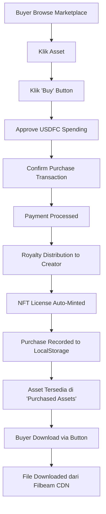

# 🔐 Panduan Akses Asset Digital untuk Buyer

Dokumentasi lengkap tentang bagaimana buyer dapat mengakses dan mendownload asset digital yang telah mereka beli di marketplace Filora.

---

## 📍 Dimana Buyer Bisa Akses Asset yang Dibeli?

Buyer dapat mengakses asset digital yang sudah dibeli melalui **3 cara**:

### 1. 🛒 Tab "Purchased Assets" (Recommended)

Lokasi utama untuk mengakses semua asset yang sudah dibeli.

**Cara Akses:**
```
1. Buka aplikasi Filora (http://localhost:3004)
2. Connect wallet
3. Klik tab "Purchased Assets" atau "My Purchases"
4. Lihat semua asset yang sudah dibeli
5. Klik tombol "Download Asset" untuk download
```

**Fitur yang Tersedia:**
- ✅ List semua asset yang sudah dibeli
- ✅ Download button untuk setiap asset
- ✅ View NFT License
- ✅ Verify License on-chain
- ✅ Asset details (CID, price, purchase date)
- ✅ Pagination (6 items per page)

### 2. 📄 Halaman Detail Asset

Buyer juga bisa akses dari halaman detail asset.

**Cara Akses:**
```
1. Buka marketplace
2. Klik asset yang sudah dibeli
3. Jika sudah dibeli, akan muncul badge "✅ Owned"
4. Button "Download" akan tersedia
5. Klik download untuk mengunduh file
```

### 3. 📁 Tab "My Assets"

Semua asset yang di-upload dan dibeli juga bisa diakses di sini.

**Cara Akses:**
```
1. Klik tab "My Assets"
2. Lihat list dataset
3. Expand dataset untuk lihat pieces
4. Klik download pada piece yang dimiliki
```

---

## 🔄 Alur Pembelian hingga Akses

### Step-by-Step Process:



### Detail Setiap Step:

#### 1️⃣ **Pembelian Asset**
```typescript
// User klik "Buy" button
→ Modal pembelian terbuka
→ Review price & royalty breakdown
→ Approve USDFC token spending
→ Confirm purchase transaction
→ Smart contract FilecoinPay process payment
```

#### 2️⃣ **Automatic NFT Minting**
```typescript
// Setelah payment sukses
→ Hook usePurchasedAssets otomatis trigger
→ Mint NFT license via FiloraLicense1155 contract
→ NFT dikirim ke wallet buyer
→ License hash & token ID disimpan
```

#### 3️⃣ **Recording Purchase**
```typescript
// Purchase disimpan di localStorage
{
  datasetId: number,
  pieceId: number,
  pieceCid: string,
  price: string,
  seller: string,
  buyer: string,
  purchasedAt: timestamp,
  txHash: string,
  nftTokenId: string,
  licenseHash: string
}
```

#### 4️⃣ **Access Control**
```typescript
// useAssetAccess hook check ownership
hasAccess(datasetId, pieceId) {
  return purchases.includes(asset);
}
```

#### 5️⃣ **Download Process**
```typescript
// Buyer klik download
→ Check hasAccess()
→ Generate access token (valid 24 hours)
→ Try download from Filbeam CDN (fast)
→ Fallback to Synapse if CDN fails
→ File downloaded to local device
```

---

## 💾 Teknologi Download

### Method 1: Filbeam CDN (Primary)
- **URL Pattern:** `https://gateway.filbeam.com/piece/{CID}`
- **Speed:** Fast (< 2 seconds)
- **Reliability:** High
- **Use Case:** Primary download method

### Method 2: Synapse SDK (Fallback)
- **Method:** `synapse.storage.download(commp)`
- **Speed:** Medium (5-10 seconds)
- **Reliability:** Very High
- **Use Case:** Backup jika CDN gagal

### Implementasi:
```typescript
// hooks/useDownloadPiece.ts
const downloadPiece = async (commp: string) => {
  try {
    // 1. Try Filbeam CDN first
    const filbeamUrl = getFilbeamPieceUrl(commp);
    const response = await fetch(filbeamUrl);
    
    if (response.ok) {
      const blob = await response.blob();
      // Download file
      return downloadFile(blob, filename);
    }
  } catch (error) {
    console.warn("CDN failed, using Synapse fallback");
  }

  // 2. Fallback to Synapse
  const bytes = await synapse.storage.download(commp);
  return downloadFile(bytes, filename);
};
```

---

## 🔐 Security & Access Control

### 1. **Ownership Verification**
```typescript
// Check jika buyer memiliki asset
const hasAccess = (datasetId, pieceId) => {
  const purchase = purchases.find(
    p => p.datasetId === datasetId && p.pieceId === pieceId
  );
  return !!purchase;
};
```

### 2. **NFT License Verification**
```typescript
// Verify on-chain license
const verifyLicense = async (datasetId, pieceId) => {
  const tokenId = generateTokenId(datasetId, pieceId);
  const balance = await FiloraLicense1155.balanceOf(buyer, tokenId);
  return balance > 0;
};
```

### 3. **Access Token Generation**
```typescript
// Generate temporary access token
const accessToken = {
  buyer: buyerAddress,
  datasetId: datasetId,
  pieceId: pieceId,
  timestamp: Date.now(),
  expires: Date.now() + (24 * 60 * 60 * 1000) // 24 hours
};
const token = btoa(JSON.stringify(accessToken));
```

---

## 📱 UI Components untuk Buyer Access

### 1. **PurchasedAssets Component**
```typescript
// components/marketplace/PurchasedAssets.tsx
<PurchasedAssets>
  {purchases.map(asset => (
    <AssetCard>
      <AssetInfo cid={asset.pieceCid} />
      <PriceInfo price={asset.price} />
      <DownloadButton onClick={handleDownload} />
      <ViewLicenseButton onClick={viewNFT} />
    </AssetCard>
  ))}
</PurchasedAssets>
```

### 2. **Download Button**
```typescript
<button
  onClick={handleDownload}
  disabled={isDownloading}
  className="download-button"
>
  {isDownloading ? "⏳ Downloading..." : "⬇️ Download Asset"}
</button>
```

### 3. **License Verification Badge**
```typescript
{hasLicense && (
  <div className="license-badge">
    ✅ Licensed • NFT #{nftTokenId}
  </div>
)}
```

---

## 📊 Data Storage & Persistence

### LocalStorage Structure:
```typescript
// Key: filora_purchased_assets_{walletAddress}
// Value: PurchasedAsset[]
{
  "filora_purchased_assets_0x123...": [
    {
      datasetId: 42,
      pieceId: 0,
      pieceCid: "bafk...",
      price: "10.5",
      seller: "0xabc...",
      buyer: "0x123...",
      purchasedAt: 1705123456,
      txHash: "0xdef...",
      nftTokenId: "42000",
      licenseHash: "0x789..."
    }
  ]
}
```

### Benefits:
- ✅ **Offline Access:** Data tersimpan lokal
- ✅ **Fast Loading:** Tidak perlu query blockchain
- ✅ **Persistent:** Tetap ada setelah refresh
- ✅ **Per-Wallet:** Setiap wallet punya data sendiri

---

## 🎯 User Journey Examples

### Scenario 1: First Time Buyer
```
1. Connect wallet (0x123...)
2. Browse marketplace
3. Find interesting asset (#42)
4. Click "Buy" → Pay 10 USDFC
5. Transaction confirmed ✅
6. NFT license auto-minted 🎫
7. Go to "Purchased Assets" tab
8. See asset dengan badge "✅ Owned"
9. Click "Download" → File downloaded 📥
10. Asset ready untuk digunakan!
```

### Scenario 2: Returning Buyer
```
1. Connect wallet (0x123...)
2. Data purchase auto-loaded dari localStorage
3. Go to "Purchased Assets" tab
4. See list semua asset yang pernah dibeli
5. Click download pada asset manapun
6. File downloaded instantly
```

### Scenario 3: Cross-Device Access
```
Device 1 (Desktop):
- Buy asset → NFT minted on-chain

Device 2 (Laptop):
- Connect same wallet
- Purchase belum terlihat di localStorage

Solution:
- Verify license on-chain
- Re-sync purchases dari blockchain
- Or: Re-download dengan verify NFT ownership
```

---

## 🚀 Implementasi Hooks

### 1. **usePurchasedAssets**
```typescript
const { purchases, addPurchase, getPurchase } = usePurchasedAssets();

// Add new purchase after buying
await addPurchase({
  datasetId: 42,
  pieceId: 0,
  pieceCid: "bafk...",
  price: "10.0",
  seller: seller,
  buyer: address,
  purchasedAt: Date.now() / 1000
});
```

### 2. **useAssetAccess**
```typescript
const { hasAccess, generateAccessToken } = useAssetAccess();

// Check if buyer owns asset
if (hasAccess(datasetId, pieceId)) {
  const token = await generateAccessToken(datasetId, pieceId);
  const downloadUrl = getDownloadUrl(pieceCid, token);
}
```

### 3. **useDownloadPiece**
```typescript
const { downloadMutation } = useDownloadPiece(pieceCid, filename);

// Trigger download
downloadMutation.mutate();
```

### 4. **useLicenseVerification**
```typescript
const { verifyLicense, isVerifying, hasLicense } = useLicenseVerification();

// Verify NFT ownership on-chain
await verifyLicense(datasetId, pieceId);
```

---

## ⚡ Performance Optimization

### 1. **CDN First Strategy**
- Filbeam CDN response: ~500ms - 2s
- Synapse fallback: ~5s - 10s
- Always try CDN first untuk user experience terbaik

### 2. **Caching**
- Purchase data di localStorage (instant load)
- NFT balance cached untuk 5 minutes
- Asset metadata cached untuk 10 minutes

### 3. **Lazy Loading**
- Load purchases on tab switch
- Download on-demand (tidak auto-download)
- Image preview lazy loaded

---

## 🔧 Troubleshooting

### Issue: "Asset tidak muncul di Purchased Assets"
**Solution:**
1. Check localStorage: `localStorage.getItem('filora_purchased_assets_' + address)`
2. Verify NFT di wallet
3. Re-sync dengan klik "Refresh"
4. Check transaction di block explorer

### Issue: "Download gagal"
**Solution:**
1. Check internet connection
2. Verify CID benar
3. Try manual via Filbeam: `https://gateway.filbeam.com/piece/{CID}`
4. Fallback akan auto-trigger ke Synapse

### Issue: "License verification failed"
**Solution:**
1. Pastikan wallet connected
2. Check NFT di wallet contract
3. Verify on Calibration explorer
4. Re-mint jika perlu

---

## 📝 Checklist untuk Buyer

Setelah membeli asset, pastikan:

- [ ] Transaction confirmed di wallet
- [ ] NFT license minted (check wallet)
- [ ] Asset muncul di "Purchased Assets" tab
- [ ] Download button tersedia
- [ ] File bisa di-download
- [ ] License badge muncul "✅ Licensed"
- [ ] Asset tersimpan lokal

---

## 🔗 Related Files

### Components:
- `components/marketplace/PurchasedAssets.tsx` - UI untuk purchased assets
- `components/marketplace/AssetAccessModal.tsx` - Modal akses asset
- `components/marketplace/PurchaseModal.tsx` - Modal pembelian

### Hooks:
- `hooks/usePurchasedAssets.ts` - Manage purchases
- `hooks/useAssetAccess.ts` - Access control
- `hooks/useDownloadPiece.ts` - Download functionality
- `hooks/useLicenseVerification.ts` - NFT verification
- `hooks/useNFTMint.ts` - NFT minting

### Smart Contracts:
- `FiloraLicense1155` - NFT license contract
- `FilecoinPay` - Payment processing
- `LicenseVerifier` - On-chain verification

---

## 🎯 Future Enhancements

### Planned Features:
1. **Cloud Sync** - Sync purchases across devices via IPFS
2. **Download History** - Track download activity
3. **Streaming Support** - Stream video/audio tanpa download
4. **Batch Download** - Download multiple assets sekaligus
5. **QR Code Access** - Share access via QR code
6. **Offline Mode** - Access downloaded files offline
7. **Auto-Backup** - Auto backup purchases ke IPFS

---

## 📞 Support

Jika buyer mengalami masalah akses asset:

1. **Check Documentation:**
   - Baca file ini (BUYER_ACCESS_GUIDE.md)
   - Review README.md untuk basic usage

2. **Debug Steps:**
   - Open browser console (F12)
   - Check errors di Network tab
   - Verify transaction di explorer
   - Test dengan asset lain

3. **Contact Support:**
   - Open GitHub issue
   - Include: wallet address, asset ID, error message
   - Attach: screenshot, transaction hash

---

**Last Updated:** Oktober 2025  
**Status:** ✅ Fully Operational  
**Network:** Filecoin Calibration Testnet

---

## 🎉 Summary

Buyer dapat mengakses asset digital yang dibeli dengan mudah melalui:

1. ✅ **Tab "Purchased Assets"** - Lokasi utama untuk semua purchases
2. ✅ **Download Button** - One-click download via Filbeam CDN
3. ✅ **NFT License** - On-chain proof of ownership
4. ✅ **Persistent Storage** - Data tersimpan di localStorage
5. ✅ **Fast Access** - CDN delivery dalam 1-2 detik

**Sistem sudah production-ready dan siap digunakan!** 🚀


