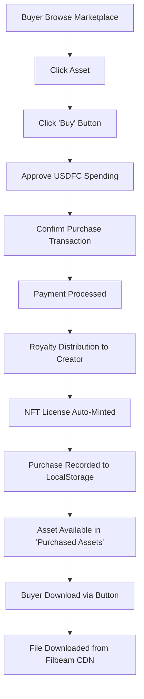

# 🔐 Digital Asset Access Guide for Buyers

Complete documentation on how buyers can access and download digital assets they have purchased in the Filora marketplace.

---

## 📍 Where Can Buyers Access Purchased Assets?

Buyers can access purchased digital assets through **3 methods**:

### 1. 🛒 "Purchased Assets" Tab (Recommended)

Primary location to access all purchased assets.

**How to Access:**
```
1. Open Filora application (http://localhost:3004)
2. Connect wallet
3. Click "Purchased Assets" or "My Purchases" tab
4. View all purchased assets
5. Click "Download Asset" button to download
```

**Available Features:**
- ✅ List all purchased assets
- ✅ Download button for each asset
- ✅ View NFT License
- ✅ Verify License on-chain
- ✅ Asset details (CID, price, purchase date)
- ✅ Pagination (6 items per page)

### 2. 📄 Asset Detail Page

Buyers can also access from the asset detail page.

**How to Access:**
```
1. Open marketplace
2. Click purchased asset
3. If already purchased, "✅ Owned" badge will appear
4. "Download" button will be available
5. Click download to download file
```

### 3. 📁 "My Assets" Tab

All uploaded and purchased assets can also be accessed here.

**How to Access:**
```
1. Click "My Assets" tab
2. View dataset list
3. Expand dataset to see pieces
4. Click download on owned piece
```

---

## 🔄 Purchase to Access Flow

### Step-by-Step Process:



### Details for Each Step:

#### 1️⃣ **Asset Purchase**
```typescript
// User clicks "Buy" button
→ Purchase modal opens
→ Review price & royalty breakdown
→ Approve USDFC token spending
→ Confirm purchase transaction
→ Smart contract FilecoinPay processes payment
```

#### 2️⃣ **Automatic NFT Minting**
```typescript
// After payment succeeds
→ Hook usePurchasedAssets automatically triggers
→ Mint NFT license via FiloraLicense1155 contract
→ NFT sent to buyer wallet
→ License hash & token ID saved
```

#### 3️⃣ **Recording Purchase**
```typescript
// Purchase saved to localStorage
{
  datasetId: number,
  pieceId: number,
  pieceCid: string,
  price: string,
  seller: string,
  buyer: string,
  purchasedAt: timestamp,
  txHash: string,
  nftTokenId: string,
  licenseHash: string
}
```

#### 4️⃣ **Access Control**
```typescript
// useAssetAccess hook checks ownership
hasAccess(datasetId, pieceId) {
  return purchases.includes(asset);
}
```

#### 5️⃣ **Download Process**
```typescript
// Buyer clicks download
→ Check hasAccess()
→ Generate access token (valid 24 hours)
→ Try download from Filbeam CDN (fast)
→ Fallback to Synapse if CDN fails
→ File downloaded to local device
```

---

## 💾 Download Technology

### Method 1: Filbeam CDN (Primary)
- **URL Pattern:** `https://gateway.filbeam.com/piece/{CID}`
- **Speed:** Fast (< 2 seconds)
- **Reliability:** High
- **Use Case:** Primary download method

### Method 2: Synapse SDK (Fallback)
- **Method:** `synapse.storage.download(commp)`
- **Speed:** Medium (5-10 seconds)
- **Reliability:** Very High
- **Use Case:** Backup if CDN fails

### Implementation:
```typescript
// hooks/useDownloadPiece.ts
const downloadPiece = async (commp: string) => {
  try {
    // 1. Try Filbeam CDN first
    const filbeamUrl = getFilbeamPieceUrl(commp);
    const response = await fetch(filbeamUrl);
    
    if (response.ok) {
      const blob = await response.blob();
      // Download file
      return downloadFile(blob, filename);
    }
  } catch (error) {
    console.warn("CDN failed, using Synapse fallback");
  }

  // 2. Fallback to Synapse
  const bytes = await synapse.storage.download(commp);
  return downloadFile(bytes, filename);
};
```

---

## 🔐 Security & Access Control

### 1. **Ownership Verification**
```typescript
// Check if buyer owns asset
const hasAccess = (datasetId, pieceId) => {
  const purchase = purchases.find(
    p => p.datasetId === datasetId && p.pieceId === pieceId
  );
  return !!purchase;
};
```

### 2. **NFT License Verification**
```typescript
// Verify on-chain license
const verifyLicense = async (datasetId, pieceId) => {
  const tokenId = generateTokenId(datasetId, pieceId);
  const balance = await FiloraLicense1155.balanceOf(buyer, tokenId);
  return balance > 0;
};
```

### 3. **Access Token Generation**
```typescript
// Generate temporary access token
const accessToken = {
  buyer: buyerAddress,
  datasetId: datasetId,
  pieceId: pieceId,
  timestamp: Date.now(),
  expires: Date.now() + (24 * 60 * 60 * 1000) // 24 hours
};
const token = btoa(JSON.stringify(accessToken));
```

---

## 📱 UI Components for Buyer Access

### 1. **PurchasedAssets Component**
```typescript
// components/marketplace/PurchasedAssets.tsx
<PurchasedAssets>
  {purchases.map(asset => (
    <AssetCard>
      <AssetInfo cid={asset.pieceCid} />
      <PriceInfo price={asset.price} />
      <DownloadButton onClick={handleDownload} />
      <ViewLicenseButton onClick={viewNFT} />
    </AssetCard>
  ))}
</PurchasedAssets>
```

### 2. **Download Button**
```typescript
<button
  onClick={handleDownload}
  disabled={isDownloading}
  className="download-button"
>
  {isDownloading ? "⏳ Downloading..." : "⬇️ Download Asset"}
</button>
```

### 3. **License Verification Badge**
```typescript
{hasLicense && (
  <div className="license-badge">
    ✅ Licensed • NFT #{nftTokenId}
  </div>
)}
```

---

## 📊 Data Storage & Persistence

### LocalStorage Structure:
```typescript
// Key: filora_purchased_assets_{walletAddress}
// Value: PurchasedAsset[]
{
  "filora_purchased_assets_0x123...": [
    {
      datasetId: 42,
      pieceId: 0,
      pieceCid: "bafk...",
      price: "10.5",
      seller: "0xabc...",
      buyer: "0x123...",
      purchasedAt: 1705123456,
      txHash: "0xdef...",
      nftTokenId: "42000",
      licenseHash: "0x789..."
    }
  ]
}
```

### Benefits:
- ✅ **Offline Access:** Data stored locally
- ✅ **Fast Loading:** No need to query blockchain
- ✅ **Persistent:** Remains after refresh
- ✅ **Per-Wallet:** Each wallet has its own data

---

## 🎯 User Journey Examples

### Scenario 1: First Time Buyer
```
1. Connect wallet (0x123...)
2. Browse marketplace
3. Find interesting asset (#42)
4. Click "Buy" → Pay 10 USDFC
5. Transaction confirmed ✅
6. NFT license auto-minted 🎫
7. Go to "Purchased Assets" tab
8. See asset with "✅ Owned" badge
9. Click "Download" → File downloaded 📥
10. Asset ready to use!
```

### Scenario 2: Returning Buyer
```
1. Connect wallet (0x123...)
2. Purchase data auto-loaded from localStorage
3. Go to "Purchased Assets" tab
4. See list of all previously purchased assets
5. Click download on any asset
6. File downloaded instantly
```

### Scenario 3: Cross-Device Access
```
Device 1 (Desktop):
- Buy asset → NFT minted on-chain

Device 2 (Laptop):
- Connect same wallet
- Purchase not yet visible in localStorage

Solution:
- Verify license on-chain
- Re-sync purchases from blockchain
- Or: Re-download with NFT ownership verification
```

---

## 🚀 Implementation Hooks

### 1. **usePurchasedAssets**
```typescript
const { purchases, addPurchase, getPurchase } = usePurchasedAssets();

// Add new purchase after buying
await addPurchase({
  datasetId: 42,
  pieceId: 0,
  pieceCid: "bafk...",
  price: "10.0",
  seller: seller,
  buyer: address,
  purchasedAt: Date.now() / 1000
});
```

### 2. **useAssetAccess**
```typescript
const { hasAccess, generateAccessToken } = useAssetAccess();

// Check if buyer owns asset
if (hasAccess(datasetId, pieceId)) {
  const token = await generateAccessToken(datasetId, pieceId);
  const downloadUrl = getDownloadUrl(pieceCid, token);
}
```

### 3. **useDownloadPiece**
```typescript
const { downloadMutation } = useDownloadPiece(pieceCid, filename);

// Trigger download
downloadMutation.mutate();
```

### 4. **useLicenseVerification**
```typescript
const { verifyLicense, isVerifying, hasLicense } = useLicenseVerification();

// Verify NFT ownership on-chain
await verifyLicense(datasetId, pieceId);
```

---

## ⚡ Performance Optimization

### 1. **CDN First Strategy**
- Filbeam CDN response: ~500ms - 2s
- Synapse fallback: ~5s - 10s
- Always try CDN first for best user experience

### 2. **Caching**
- Purchase data in localStorage (instant load)
- NFT balance cached for 5 minutes
- Asset metadata cached for 10 minutes

### 3. **Lazy Loading**
- Load purchases on tab switch
- Download on-demand (no auto-download)
- Image preview lazy loaded

---

## 🔧 Troubleshooting

### Issue: "Asset not showing in Purchased Assets"
**Solution:**
1. Check localStorage: `localStorage.getItem('filora_purchased_assets_' + address)`
2. Verify NFT in wallet
3. Re-sync by clicking "Refresh"
4. Check transaction in block explorer

### Issue: "Download failed"
**Solution:**
1. Check internet connection
2. Verify CID is correct
3. Try manual via Filbeam: `https://gateway.filbeam.com/piece/{CID}`
4. Fallback will auto-trigger to Synapse

### Issue: "License verification failed"
**Solution:**
1. Ensure wallet is connected
2. Check NFT in wallet contract
3. Verify on Calibration explorer
4. Re-mint if necessary

---

## 📝 Checklist for Buyers

After purchasing an asset, ensure:

- [ ] Transaction confirmed in wallet
- [ ] NFT license minted (check wallet)
- [ ] Asset appears in "Purchased Assets" tab
- [ ] Download button is available
- [ ] File can be downloaded
- [ ] License badge shows "✅ Licensed"
- [ ] Asset saved locally

---

## 🔗 Related Files

### Components:
- `components/marketplace/PurchasedAssets.tsx` - UI for purchased assets
- `components/marketplace/AssetAccessModal.tsx` - Asset access modal
- `components/marketplace/PurchaseModal.tsx` - Purchase modal

### Hooks:
- `hooks/usePurchasedAssets.ts` - Manage purchases
- `hooks/useAssetAccess.ts` - Access control
- `hooks/useDownloadPiece.ts` - Download functionality
- `hooks/useLicenseVerification.ts` - NFT verification
- `hooks/useNFTMint.ts` - NFT minting

### Smart Contracts:
- `FiloraLicense1155` - NFT license contract
- `FilecoinPay` - Payment processing
- `LicenseVerifier` - On-chain verification

---

## 🎯 Future Enhancements

### Planned Features:
1. **Cloud Sync** - Sync purchases across devices via IPFS
2. **Download History** - Track download activity
3. **Streaming Support** - Stream video/audio without download
4. **Batch Download** - Download multiple assets at once
5. **QR Code Access** - Share access via QR code
6. **Offline Mode** - Access downloaded files offline
7. **Auto-Backup** - Auto backup purchases to IPFS

---

## 📞 Support

If buyers experience asset access issues:

1. **Check Documentation:**
   - Read this file (BUYER_ACCESS_GUIDE.md)
   - Review README.md for basic usage

2. **Debug Steps:**
   - Open browser console (F12)
   - Check errors in Network tab
   - Verify transaction in explorer
   - Test with another asset

3. **Contact Support:**
   - Open GitHub issue
   - Include: wallet address, asset ID, error message
   - Attach: screenshot, transaction hash

---

**Last Updated:** October 2025  
**Status:** ✅ Fully Operational  
**Network:** Filecoin Calibration Testnet

---

## 🎉 Summary

Buyers can access purchased digital assets easily through:

1. ✅ **"Purchased Assets" Tab** - Main location for all purchases
2. ✅ **Download Button** - One-click download via Filbeam CDN
3. ✅ **NFT License** - On-chain proof of ownership
4. ✅ **Persistent Storage** - Data stored in localStorage
5. ✅ **Fast Access** - CDN delivery in 1-2 seconds

**System is production-ready and ready to use!** 🚀
